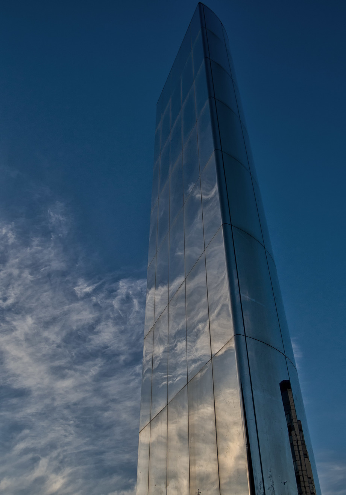

Another icon of the bay; this is a water "sculpture" that stands just opposite the Wales Millennium Centre. I like the way its reflectivity makes it seem to be part of the sky, particularly here, with the clouds adding to the effect. 

