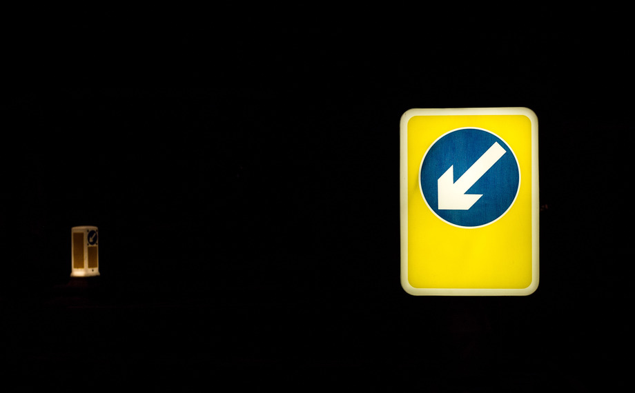

My first attempt at going out shooting in the street at night. We tried to get some light trails on the roads, but when you're really looking for a spot to do long exposures, you notice how much light pollution there is (though frankly, in the grand scheme of things, I quite like streetlamps). 

Thanks to [Ben](https://www.flickr.com/ben_pope2000) for accompanying me. Can get a bit hairy at night. Photographing, that is; not Ben. 

