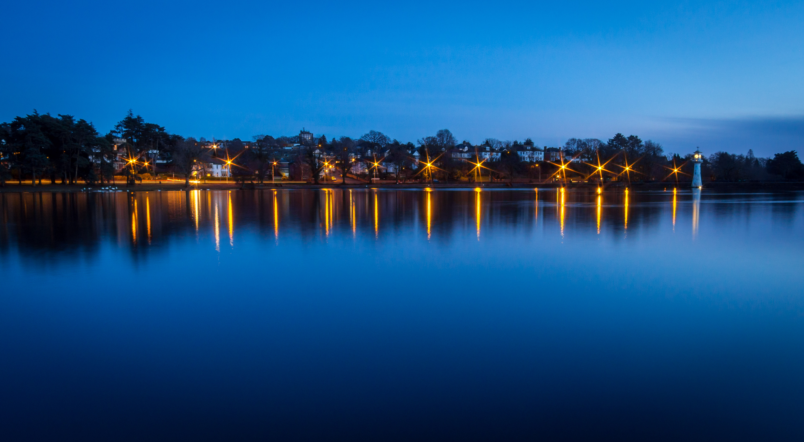

My first attempt at a long exposure (13s) up at the lake. I think it lacks a decent focal point, but the colours are good. I'd like to get some more light trails in next time. Excellently, I didn't drop any equipment in the water. 

