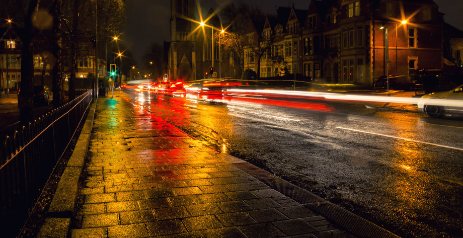

Went out again tonight in the dark and the rain, and really wanted to get *something*. Still a bit nervous/self-conscious about whipping out my tripod (weeey), so I rested the camera on a bin, and got what I could. I used the manual
focus Samyang 12mm, so it's a bit blurry. Definitely want to do more night-time long exposures. 

