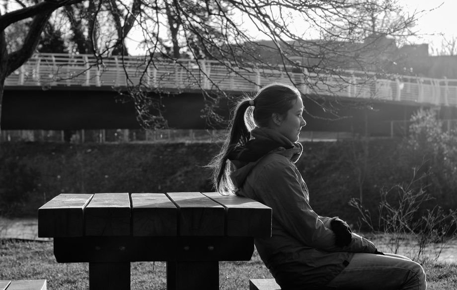

I really like street photography, and I really want to improve my confidence in photographing people. This isn't a street, admittedly, but I saw the light falling just right on this young lady sitting and looking out over the river, and decided I had to try to get the picture. Making images regularly, and trying to _find_ a picture in your surroundings, is great to get you to really start seeing what is going on around you. 

