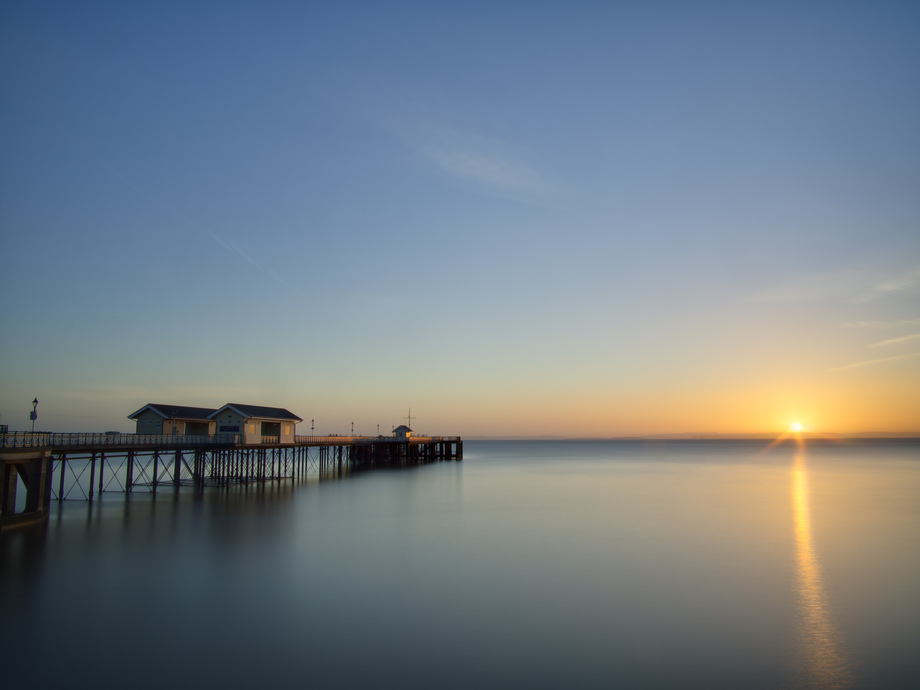

Early on a Saturday morning, with the weather looking clear, [Adam](https://www.flickr.com/photos/priceadam/) and myself dragged our arses out of bed, and down to Penarth pier. Tripod club was already in full swing by the time we got there, so we got set up and managed to grabbed a few decent shots. This one is a 10-image HDR with pretty long exposure lengths (approx. 3-40s) so it's a little soft, but I think it came out really nicely, except for the sun being a little far to the right. Next time, next time... 

