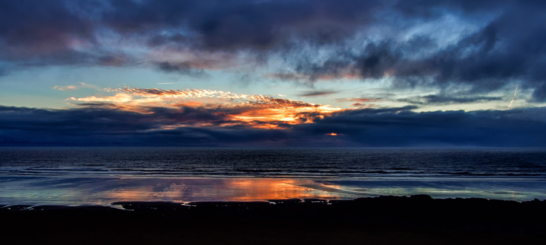

This second shot was taken just as it was getting dark, and the sun was dipping below the horizon. The rain came pretty soon afterwards. I'm hoping to get back to this spot soon, hopefully when it's a little clearer - the elevated position really allows the Sun's reflection to be seen in the wet sand. 

Leave a comment if you have any suggestions for improvement. It's not a picture of a building, anyway. 

