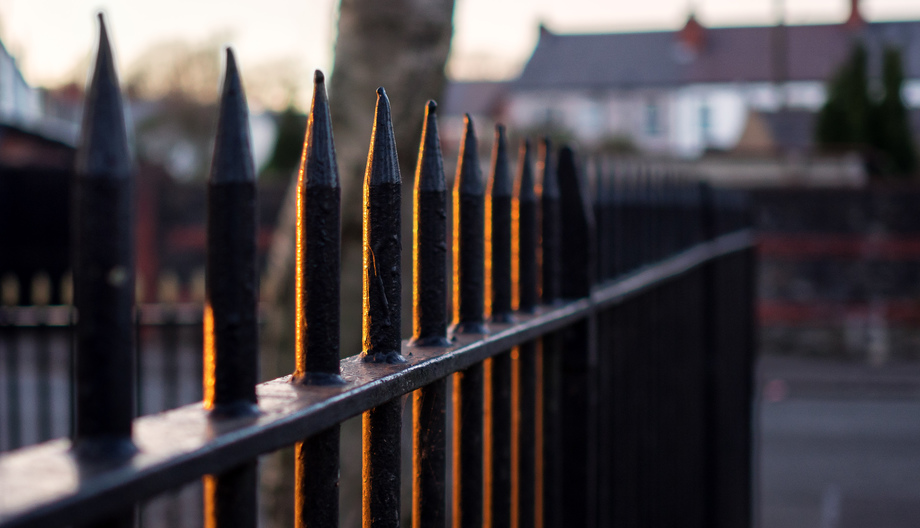

The last rays of winter sun, low in the sky, warm a fence in Penylan. Just a few minutes later, it was gone. I had to crop this a lot, as I didn't really compose it properly. There's a balance between not missing the shot, and rushing it. Didn't quite get it right here, but I like the colours. 

