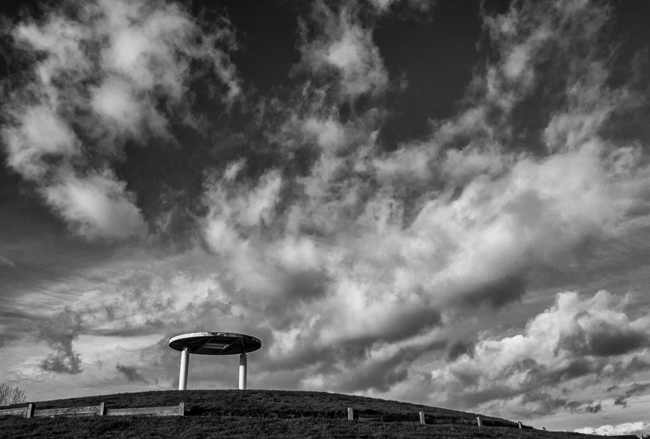

Cheating a little to catch up, this is a picture I took on 10.01.2015 (still part of the photo 365 period!) of... well, I don't really know what it is. It's near Penarth marina, on top of a mound, and inside there is a mosaic of a foot... yeah. If anyone knows what and why it is, let me know. 

