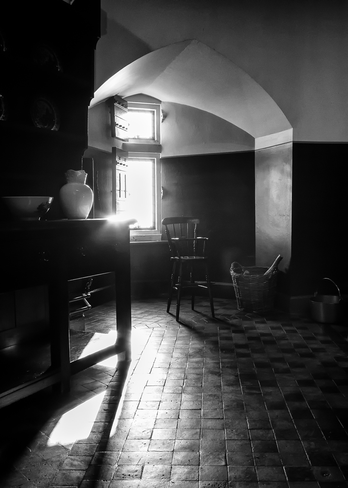

A nice bit of sunlight through the window of the kitchen in Castell Coch, Cardiff. I'm really starting to appreciate what "chasing the light" is all about. An interesting bit of light can really make or break a photograph. This one isn't perfect, but a nice bit of sunlight makes it more than just a picture of a chair (I hope...). 

