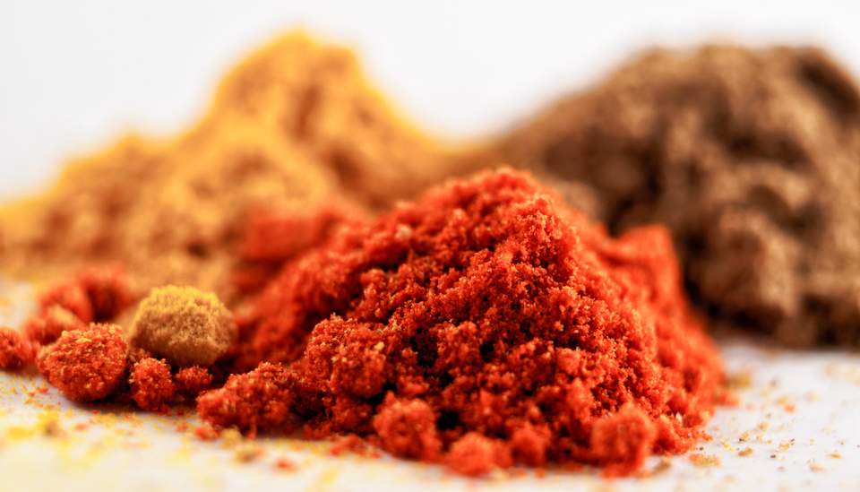

Due to the freezing cold and rain, it's been a bit harder to get out and get pictures. So, I've rigged up a light tent out of some cardboard, tracing paper, and a couple of lamps. Adding some [Meike extension tubes](http://www.amazon.co.uk/Meike-Automatic-Extension-Olumpus-Panasonic/dp/B00BY0F0P0/ref=sr_1_2?s=electronics&ie=UTF8&qid=1424723152&sr=1-2&keywords=olympus+extension+tubes) has allowed me to have a little go at "macro" photography, without having to buy a £500 macro lens. 

In short, it's really tricky, as evidenced below. Even at f/22, and using the 10mm extension tube (not the 16mm), the depth of field is insanely narrow, and it's very difficult to get a useful amount of the scene in focus. 

Still, it's something new to learn. I might have a look at focus stacking at some point (taking a series of images with different "depths" of the subject in focus, and then combining the results to give an image that is sharp all over). I'd like to do some more food photography, so if nothing else this is a start. 

