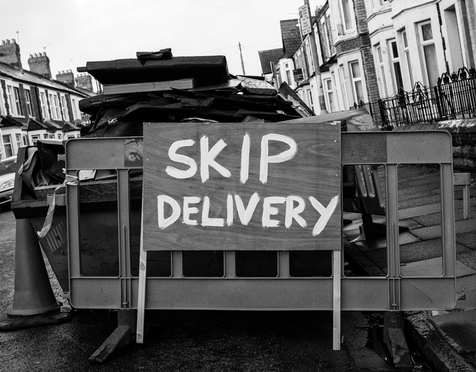

Still struggling with the cold and rain, but I managed to get out. I'm disappointed I didn't get something good, as I've been quite happy with my progress recently. But the main thing is still feeling motivated to get out, and just shoot. 

There's no doubt whatsoever, that whilst out walking, I saw plenty of people that were vastly more interesting than this mildly amusing sign. I'm still fearful of getting their photograph. I don't know why. Working on it, though. [This video](https://www.youtube.com/watch?v=-VmAbMO5NBI) by/of Eric Kim is pretty amazing - on one hand he gets great images, and on another, he really has a good rapport with people he photographs; even when they don't want their picture taken, it's relaxed and jovial. Maybe the sunshine helps. He also claims that when setting out on his journey into street photography, he was nervous and, probably, a bit creepy. Improving his confidence in street photography has improved his confidence in life. I'd like to at least try to do the same. 

