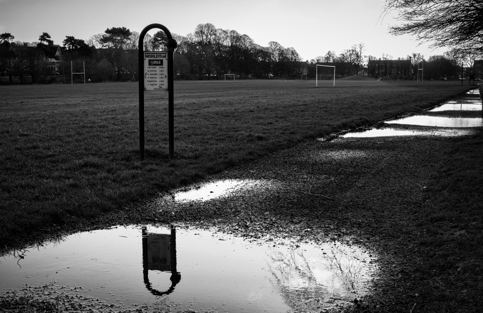

Didn't manage to get out much this weekend, but I've been trying to work on some more basic compositional techniques - contrast, opposites, reflections, etc. The subject matter here isn't amazing (yes, it's awful), but I like the reflection, and the leading line of the path. It's all about getting out every day (or as close to as possible). 

