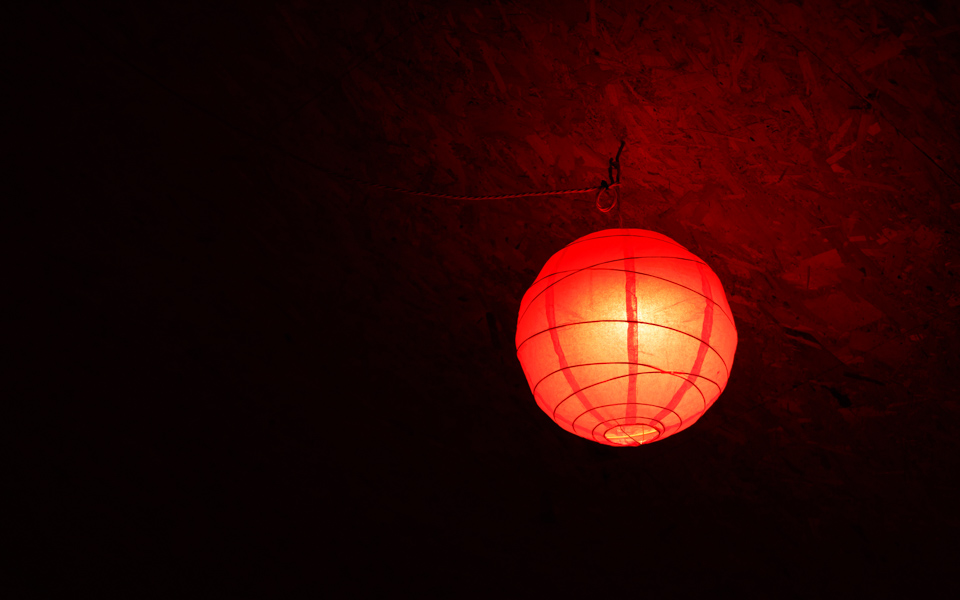

A nice red light shade in The Spit & Sawdust, Cardiff's latest skatepark/restaurant hybrid. The Olympus 45mm is incredible in low light, and remains tack-sharp at f/1.8. Really puts the 17mm to shame, sadly. 

Oh, and happy 70th photo to me! At the risk of a jinx, this is looking doable... 

