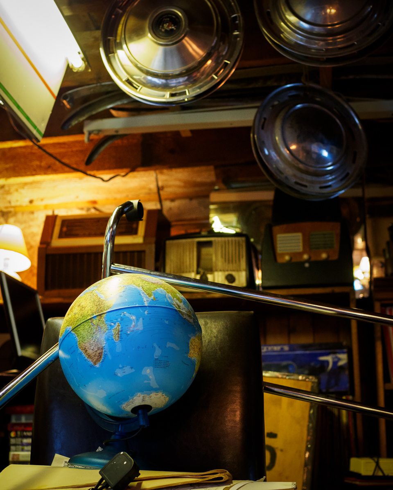

I've cheated a little, including two pictures from one day, but I liked the circles in this. Composition is something I need to improve, and the balancing of the small globe and larger hub caps is not bad. I do wish the plug wasn't there, but there was hardly room to swing a gerbil, let alone a cat. 

