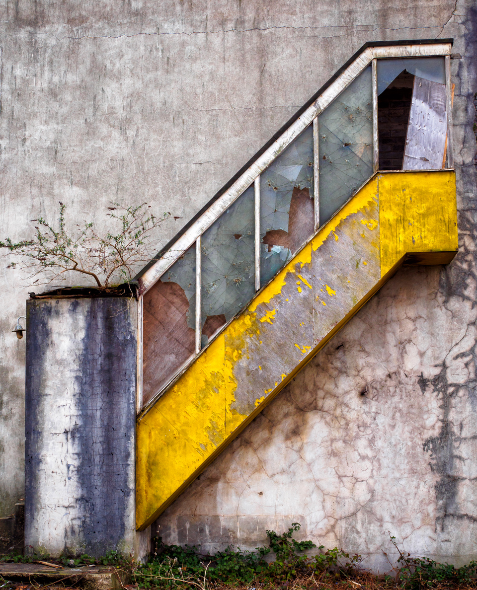

I spotted this abandoned but colourful staircase in Cardiff Bay. Cracked and forgotten, but retaining a little of its former glory; even the shards of window don't quite want to let go. I especially like the little tree that has decided to make a go of things here, abandoned or not. 

