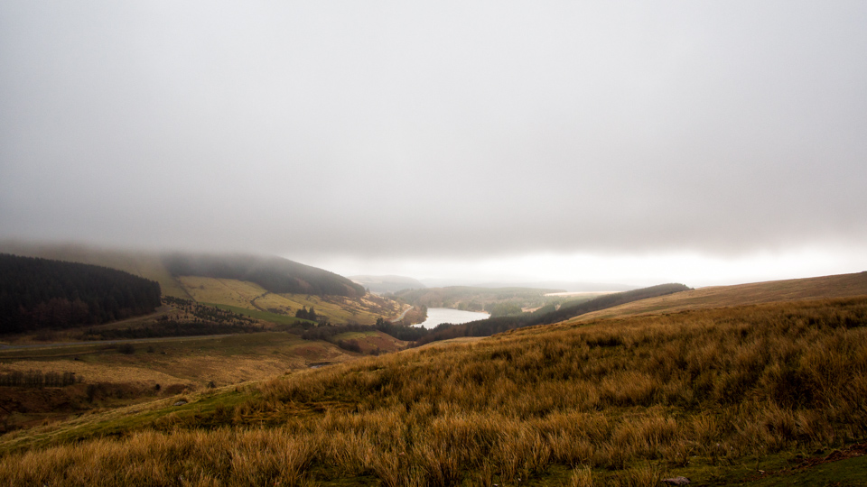

Almost titled it "Skyfall" but thought it was too much. I think this is Nant Ddu reservoir, in Brecon. The light falling through the falling sky just picked out the water for a couple of minutes. After this the mist covered things pretty rapidly. 

