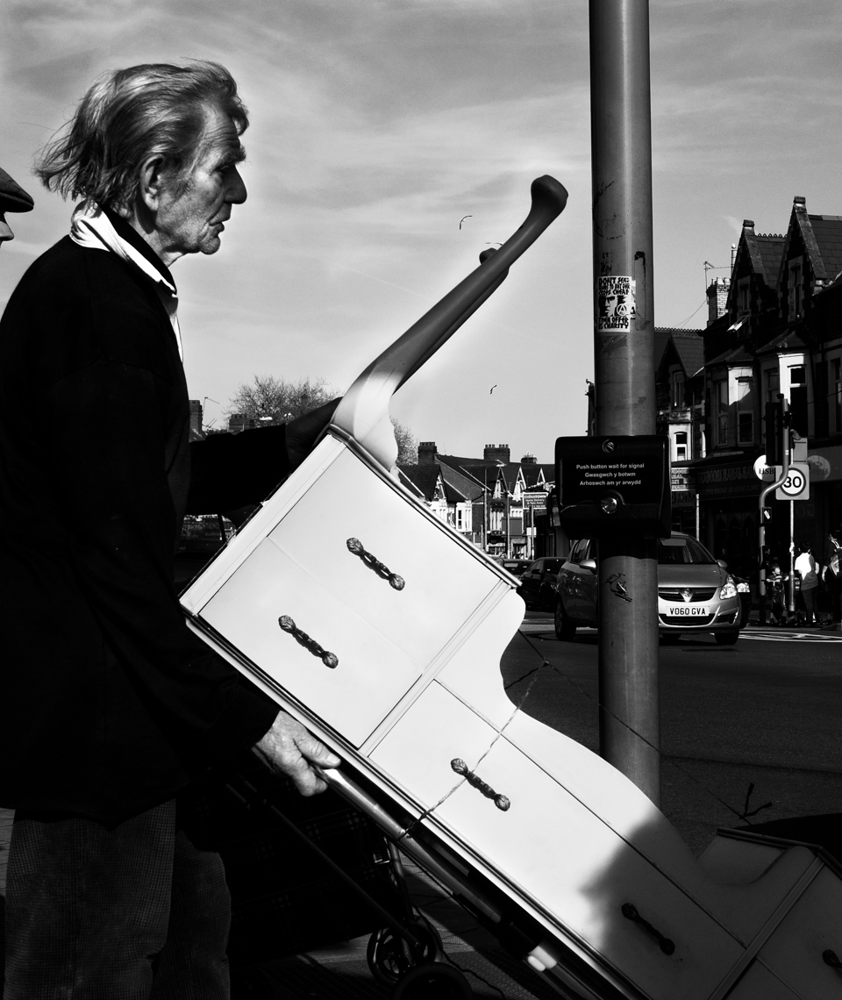

Older gent transporting his table. I should have been braver with the composition here, losing the streelight, and waiting for the low sunlight to really catch his face. Whimped out though, and now I regret it. I've gone for a really high contrast  black and white conversion here; still deciding if it's too much. 

