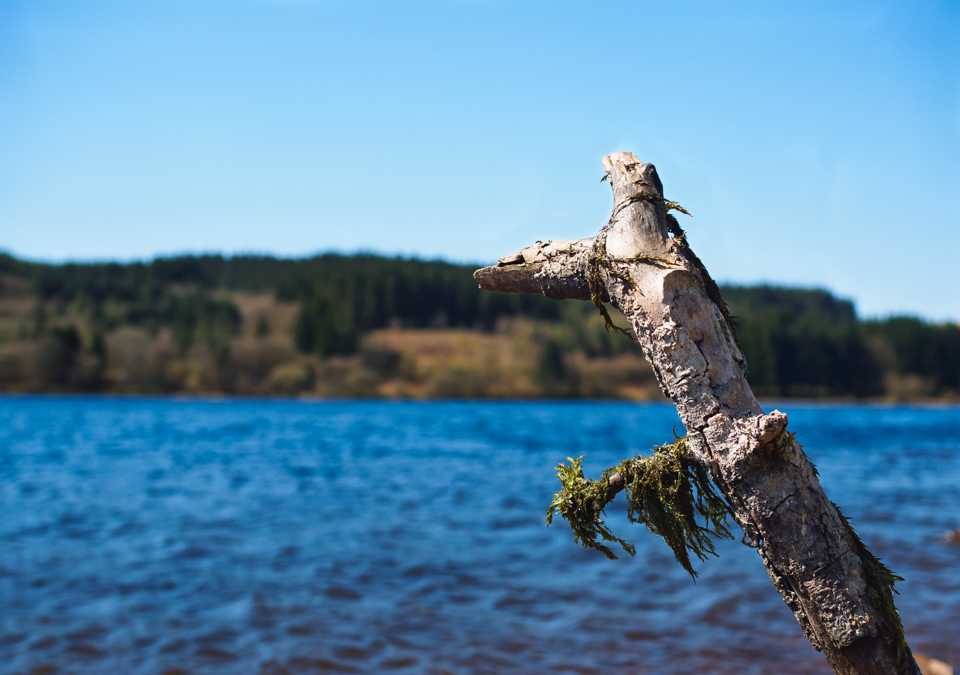

Playing around with the Tone Curve in Lightroom to give this (hopefully) a bit of a summery look. Pushed up the blues a little, raised the black level a little to make it a bit hazy, and did a bit of dodging on the stick. 

