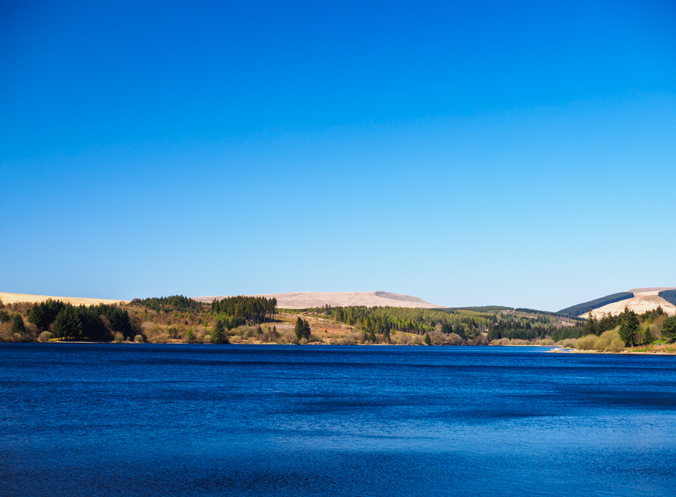

Didn't mean to take this at f/4, but I think it turned out OK. The most interesting thing for me is that this is shot with a new Marumi DHG polariser; the difference this makes to contrast and detail in landscapes is absolutely _incredible_. In particular, it made a huge difference to lightening up the foliage and deepening the blue of the water and sky. The only other edits are basic shadow/highlights, and a smidge of sharpening. At some point I'll try to show a with/without polariser image. 

