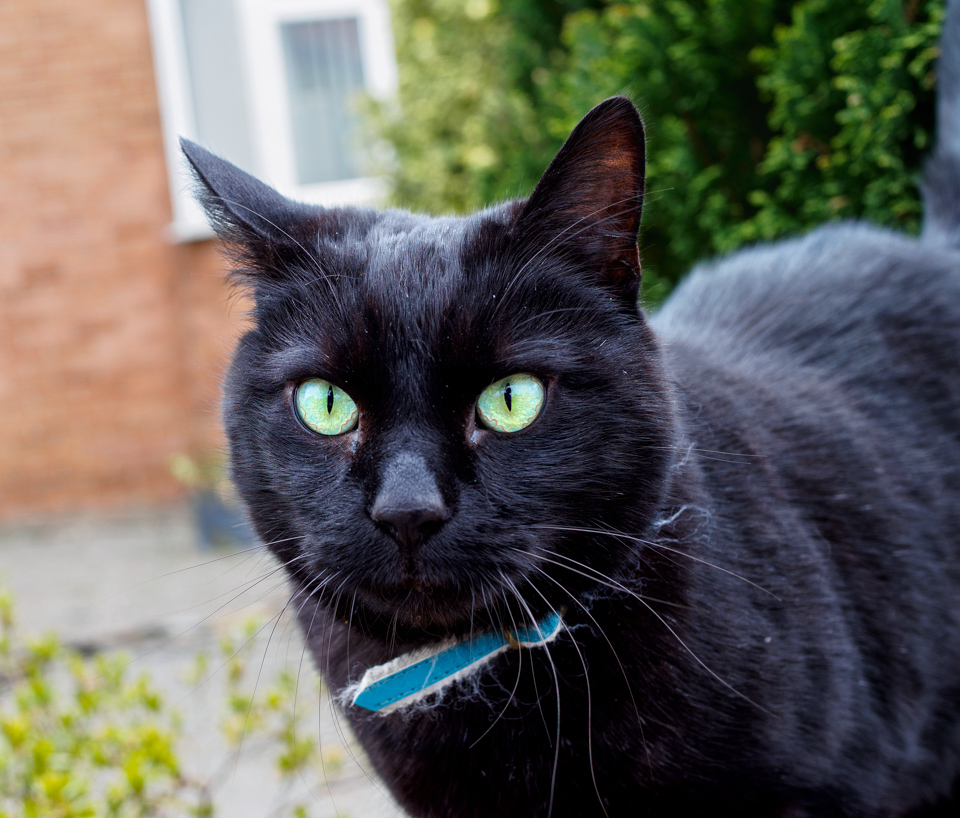

This scruffy little fellow looked pretty bored when I found him during a walk. I annoyed him for a bit, and he traded his portrait (definitely not going for the obvious pun, there) for some head rubs. Fair deal, I think. 

