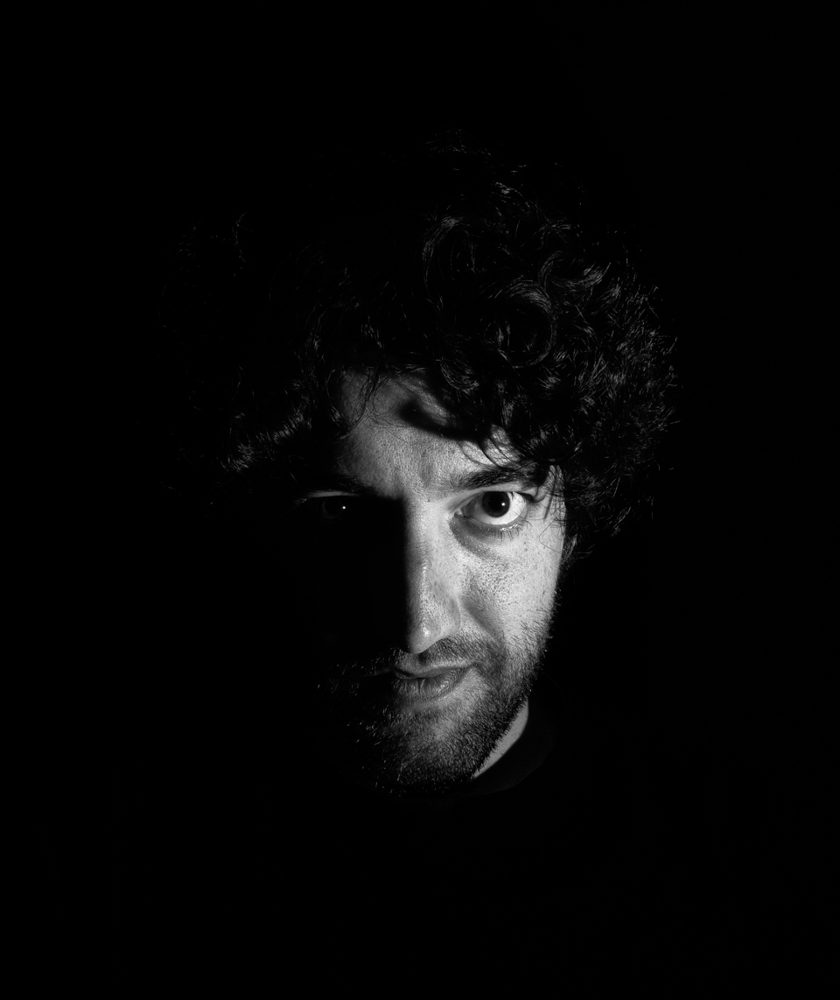

First crack at a low key self portrait, as part of my "learn to use a flash" phase. It's not quite tack sharp due to the environment being pretty dark before the flash fired, the E-M10's contrast-detection autofocus, and the stupid OI Share app deciding not to work (and therefore me not being able to preview things before triggering the camera). I also need to invest in some foundation. 

Flash: Yongnuo YN-560 III (off camera)

Trigger: RF-603 II C1

